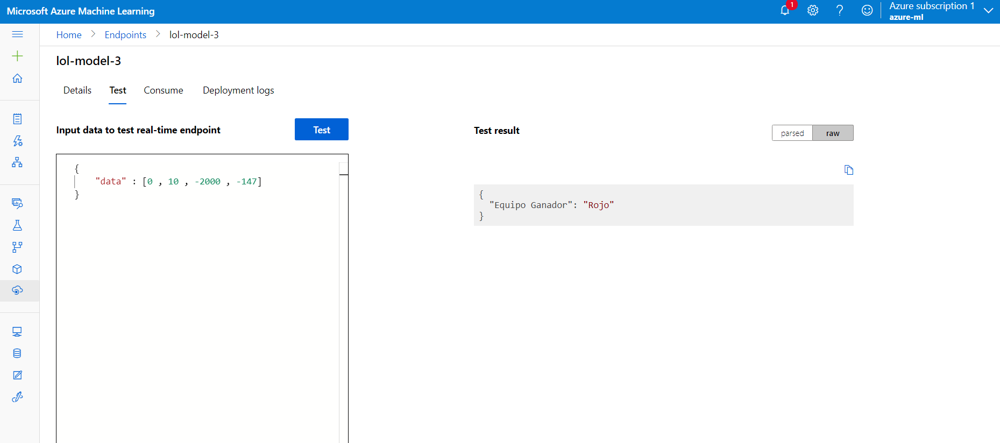
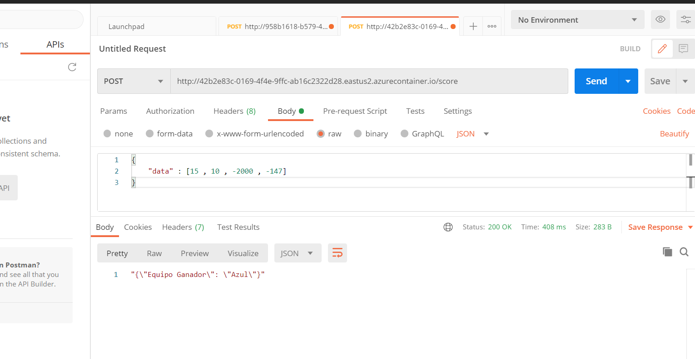

## Cloud - Especialización en analítica y ciencia de datos.

## Presentado por:

- Julian Eusse : julian.eusse@udea.edu.co


### Lol - Quien Ganara : ? --- (Equipo {Azul o Rojo})

Lolo es uno de los juegos multijugador mas jugados del mundo consiste en un enfrentamiento del equipo azul vs equipo rojo. Cada quipo tiene 5 jugadores. la idea es explotar el nexo del enemigo [Lol](https://es.wikipedia.org/wiki/League_of_Legends).

El ejercicio actual consiste en predecir si el equipo azul ganara según unos parámetros del juego. El objetivo del proyecto es desplegar un servicio   en la nube publica Azure mediante AzureMl. Este servicio será capaz de predecir cual equipo ganara


## Descripción de los datos
[Lol Dataset](https://www.kaggle.com/bobbyscience/league-of-legends-soloq-ranked-games)

- Kills : # Kills equipo Azul
- deaths : # Kills equipo rojo
- goldDiff : Diferencia de hora entre los equipos
- expDiff : Diferencia de experiencia entre los equipos
- hasWon : Pedio equipo Azul 0 = No, 1 = Gano Equipo Azul


## Requerimientos

- Subscripción de Azure.
- Docker, solo para ambiente local, recomendado para procesos de debug.
- Crear ambiente
- Python 3.8 -
- IDE vs code o equivalente.

## Pasos

- Crear un nuevo ambiente 
- Instalar las siguientes dependencias

```bash
pip install -r requirements.txt
```
- Crear modelo 

```bash
python ./src/train.py
```

### Azure

```bash
python ./01-create-environment.py
```


```bash
python ./02-create-compute.py
```

```bash
python ./03-test-workspace-remote.py
```

```bash
python ./04-azure-model-registration.py
```

```bash
python ./05-deploy-azure-model-aci.py
```


## Servicio Azure Test

Link Api [Api-Lol](http://42b2e83c-0169-4f4e-9ffc-ab16c2322d28.eastus2.azurecontainer.io/score) 

La Api es con fines educativos por tal motivop solo esta disponible por un tiempo determinado 


- Kills : # Kills equipo Azul (15)
- deaths : # Kills equipo rojo (10)
- goldDiff : Diferencia de hora entre los equipos (-2000)
- expDiff : Diferencia de experiencia entre los equipos (-147)
- hasWon : Pedio equipo Azul 0 = No, 1 = Gano Equipo Azul 


```yaml
{
    "data" : [15 , 10 , -2000 , -147]
}

```




## Postman Test

http://42b2e83c-0169-4f4e-9ffc-ab16c2322d28.eastus2.azurecontainer.io/score

